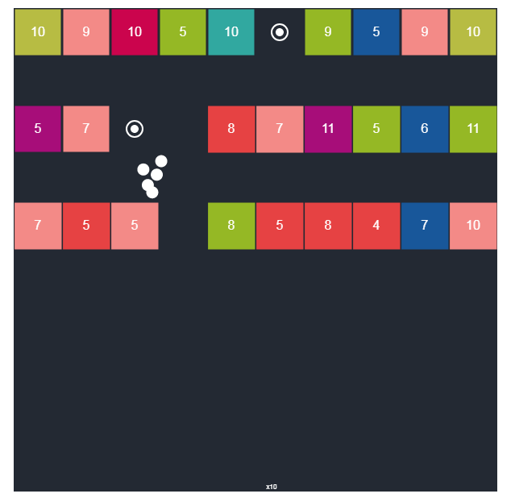

# Games
These are some games I like to build on my free time. 
I have also buid H2D which is a small framework to make it easier to develop 2D games on JS using P5.js.

# 1. Balls Bricks Breaker

# 2. Order Numbers

# 3. Canvas

